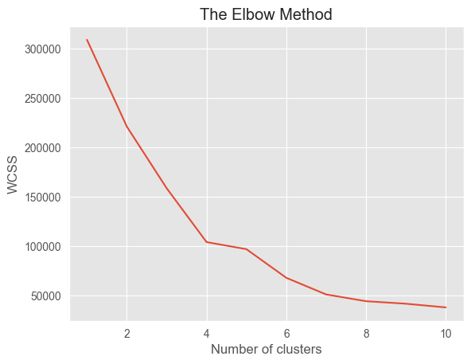
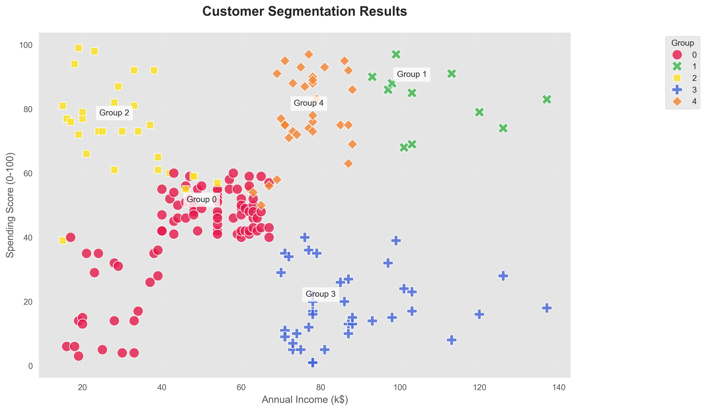

# 🎯 Mall Customer Segmentation  
**K-Means Clustering for Targeted Marketing**  

---

## 📖 Core Concepts  
Customer segmentation groups shoppers by behavior using:  
- **K-Means Algorithm**: Unsupervised learning to find natural clusters  
- **Key Features**: Age, Annual Income (k$), Spending Score (1-100)  
- **Validation**: Silhouette Score (0.36 = moderate separation)  

---

## 🔍 Key Customer Groups  
1. **Young Trendsetters** (25y | \$30k | 74/100) → Social media campaigns  
2. **Affluent Professionals** (32y | \$108k | 83/100) → Luxury experiences  
3. **Conservative Savers** (40y | \$87k | 19/100) → Discount bundles  
4. **Midlife Moderates** (46y | \$48k | 42/100) → Value packages  
5. **Family Anchors** (35y | \$76k | 78/100) → Home goods promotions  
---
## 📊 Method Preview
  
*Elbow Method Graph*  

---
---

## 📊 Results Preview  
  
*Income vs. Spending clusters (2D view)*  


## 🛠️ Project Files (Root Directory)  
All files are in the main folder for direct access:  
- `Main.ipynb` → Complete analysis notebook  
- `Mall_Customers.csv` → Raw dataset  
- `segmentation_results.jpg` → Main visualization  
- `elbow_plot.png` → Cluster selection proof  

---

## 🚀 Quick Start  
```bash
git clone https://github.com/Pallavv08/Customer-segmentation.git
jupyter notebook Main.ipynb  # All paths work from root!
